# Домашнее задание к занятию «Что такое DevOps. СI/СD» Макану А.В.
## Задание 1

### 1. Настройки проекта
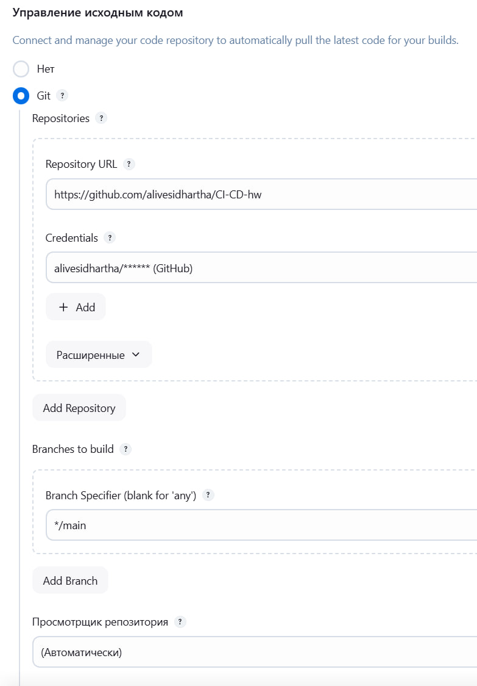
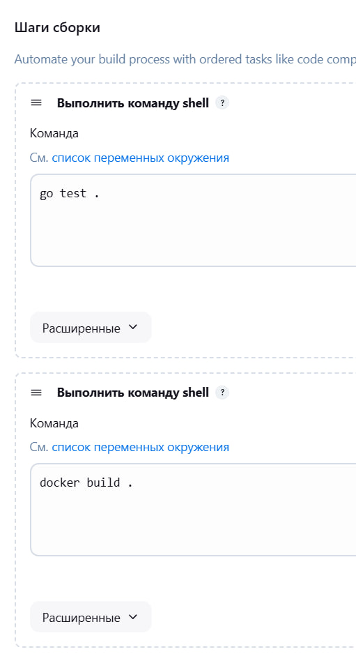

### 2. Результаты сборки
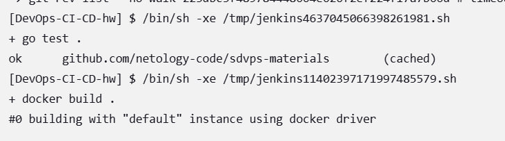
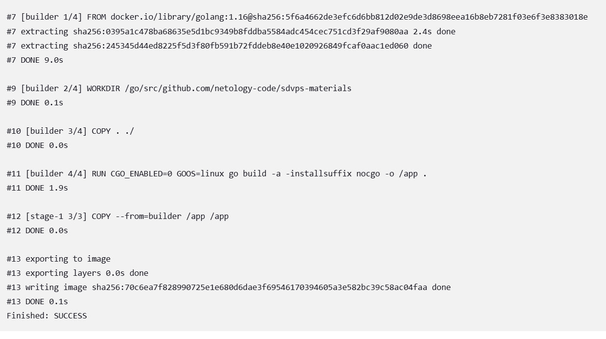

### 3. Docker-образы
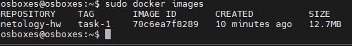

---

## Задание 2

### 1. Скрипт Pipeline
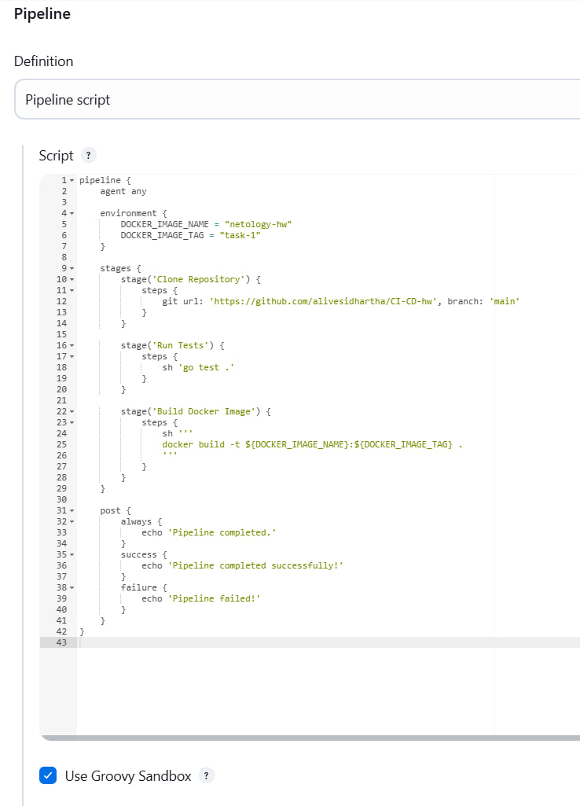

### 2. Результаты выполнения
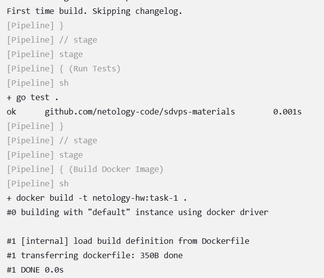
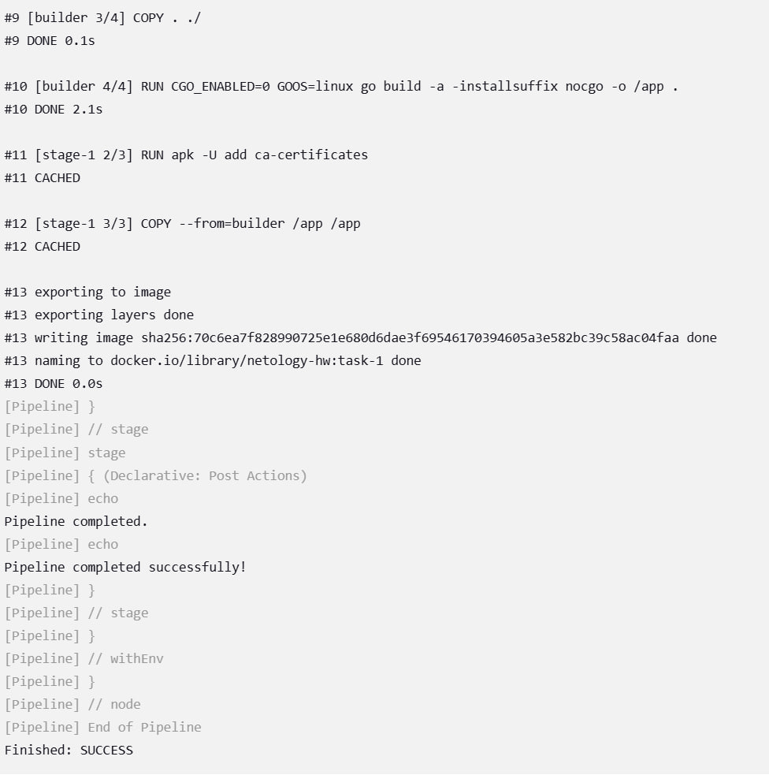

---

## Задание 3

### 1. Настройки Pipeline
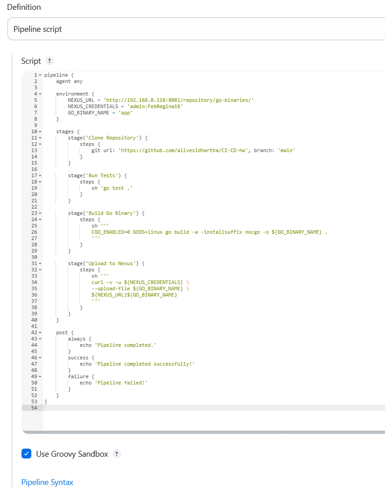

### 2. Загруженный файл в Nexus
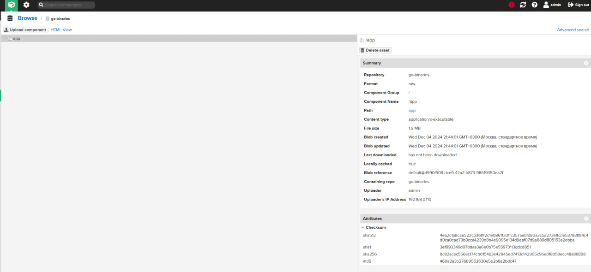

### 3. Результаты выполнения Pipeline
#### Консоль вывода (Часть 1)
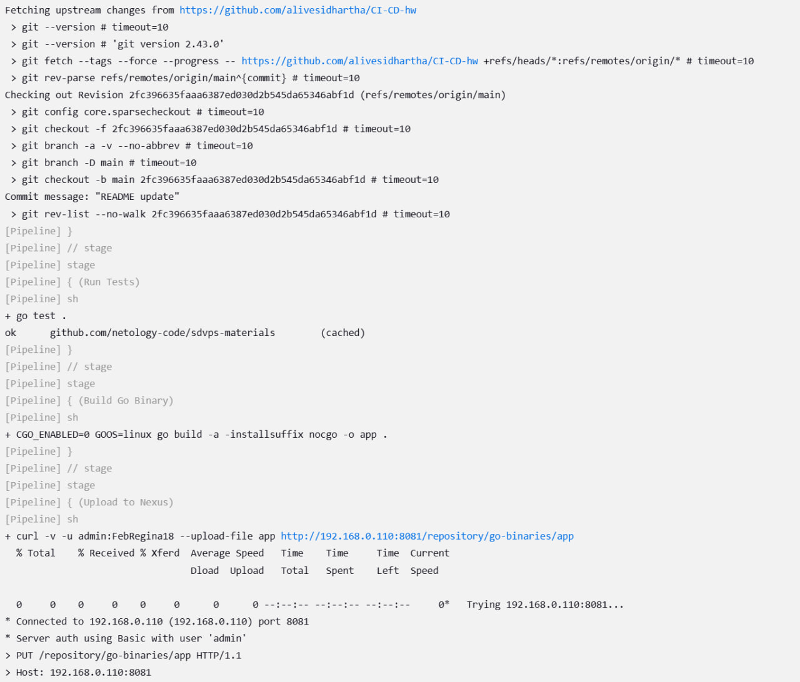
#### Консоль вывода (Часть 2)
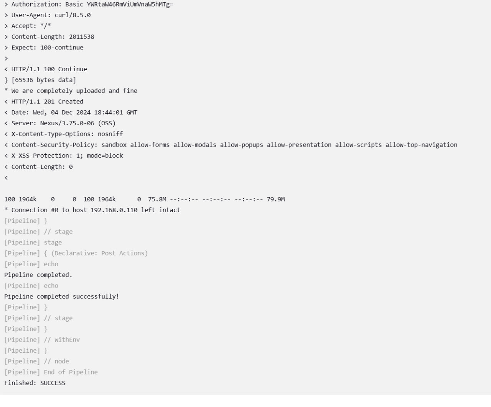
